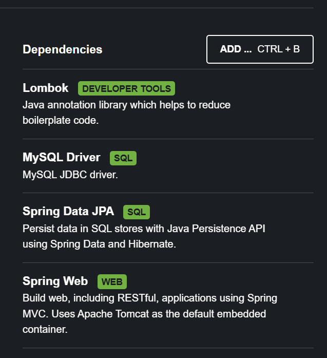

# Springboot 导入
[1小时入门教程视频](https://www.bilibili.com/video/BV1gm411m7i6/?share_source=copy_web&vd_source=db8aceb651e9de7c3673c5eee54d917f)

学习前提：我们需要知道注解是什么  
首先我们进入[Spring初始化网站](https://start.spring.io/)，快速得到初始化应用，然后选择相应的依赖

其实可以从标签看成他们的用处：  
第一个是很好用的开发者工具（非必需）  
第二个是MySQL的驱动  
第三个JPA（可以自动生成SQL相关的代码）
第三个是Web，提供RESTful架构，  

## 一个Springboot的框架

## 最简单的流程：
数据库->dao层->service->Controller  
1. 数据库由MySQL构建  
2. dao层构建类使能映射数据库   
3. service层提供处理数据库类的方法  
4. Controller层处理前端请求（CRUD）并使用service方法，然后返回前端（RESTful接口）  

最后通过IDE（或者命令行）打包jar包，然后就可以随地部署服务器了

前端请求：GET（读） POST（增） PUT(改) DELETE(删)... 我目前只接触前四种   
CRUD：Create、Read、Update、Delete。也就是增读改删