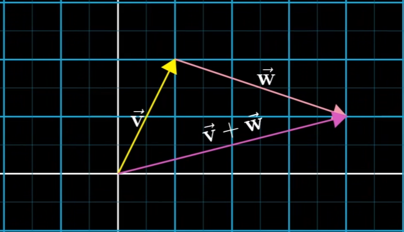

# 线性代数导入
[3Blue1Brown](https://www.bilibili.com/video/BV1ys411472E)笔记  
这里我们先用x-y坐标系说明，后续推广     
线性代数的基础是向量（vector），向量是指具有大小（Magnitude，又称 “模长”）和方向（Direction），且满足特定运算规则的抽象几何量。  
在高中我们用 $\vec{v}=(x,y)$ 定义一个向量,在几何上，从原点指向$(x,y)$点的有向线段称为向量。  
现在更常见的是这个形式 $\begin{bmatrix} x\\y \end{bmatrix}$ ，在几何上和上面同理。  
而如果你学过Cpp，知道Vector容器，你会更倾向于Vector像是一个有序数字组成的数组，定义如下：  
``` Cpp
#include <iostream>
#include <vector>
void main(){
    std::vector<int> a;
    a.emplace_back(1);
    a[0];
    std::cout<<a[0]<<std::endl;
}
```
emm，和数学向量几乎没有关系，Vector只是一个数组容器，作为数学思想的一种实现。  
我们首先要知道线性代数提供了代数和空间之间的桥梁，通过对代数可视化使得我们可以通过计算机操作数字空间。这是线性代数对计算机科学至关重要的原因之一。  
## 相加和数乘
<div class="grid" markdown>
=== "图"  
    {width=400}  
用图来表示向量，每一个向量由一个数组$\begin{bmatrix}x\\ y\end{bmatrix}$构成，表示从原点出发到终点坐标(x,y)的有向线段；一个双元数组表示唯一二维向量，反过来一个二维向量表示唯一双元数组。延申到三元同理。
</div>
### 向量相加
<div class="grid" markdown>
=== "三个向量"  
    {width=400}  
=== "表示相加"
    {width=400}
理解向量加法，我们可以把每一个向量理解成在空间上运动的一种方法，向量的和就是空间上移动距离的和$\begin{bmatrix}x_1\\ y_1\end{bmatrix}+\begin{bmatrix}x_2\\ y_2\end{bmatrix}=\begin{bmatrix}x_1+x_2\\ y_1+y_2\end{bmatrix}$
{width=400}
</div>
### 向量数乘
<div class="grid" markdown>
=== "标量(scalar)"
    {width=400}
标量和向量相乘本质是对向量的缩放，显然需要对每一个分量进行相应的缩放  
$2\cdot\begin{bmatrix}x\\ y\end{bmatrix}=\begin{bmatrix}2x\\ 2y\end{bmatrix}$
</div>

