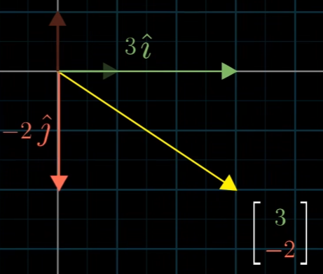
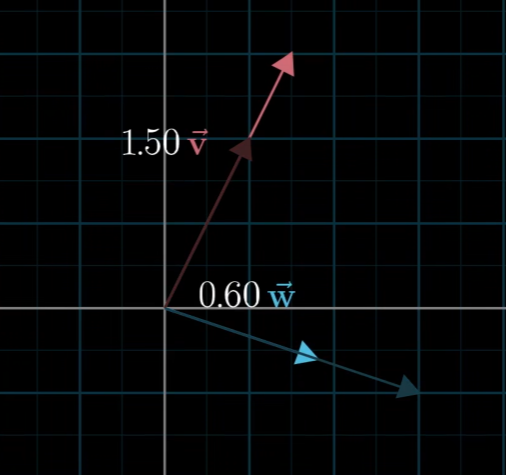

# 基 线性组合 张成的空间
基：向量空间的一组基是张成该空间的一个线性无关向量集
线性组合：两个不重合数乘向量的和
张成的空间:
## 基向量
在x-y坐标系中，有两个特殊的向量：   
**1**: $\hat{i}$:在x轴上且模长为单位1的向量  
**2**: $\hat{j}$:在y轴上且模长为单位1的向量  

=== "由$\hat{i},\hat{j}$向量缩放相加得到的向量和"
    {width=400}
如图，我们可以把$\begin{bmatrix}3\\ -2\end{bmatrix}$看成$3\hat{i}+(-2\hat{j})$

我们称i和j为x-y坐标系的“基向量”,在x-y坐标的任一向量都可以由标量缩放这两个基向量组合而成

### 任意的基向量
如图我们可以选择不同的基向量得到一个新坐标系，我们分别用不同的标量缩放这两个向量，不难推理，我们仍然能得到所有的二维向量。  
这样的一对基向量同$\hat{i}.\hat{j}$一样，使得一对数和二维向量之间自由转化，但是他们的
{width=400}
## 线性组合
两个数乘向量的和称为这两个向量的线性组合
Linear combination